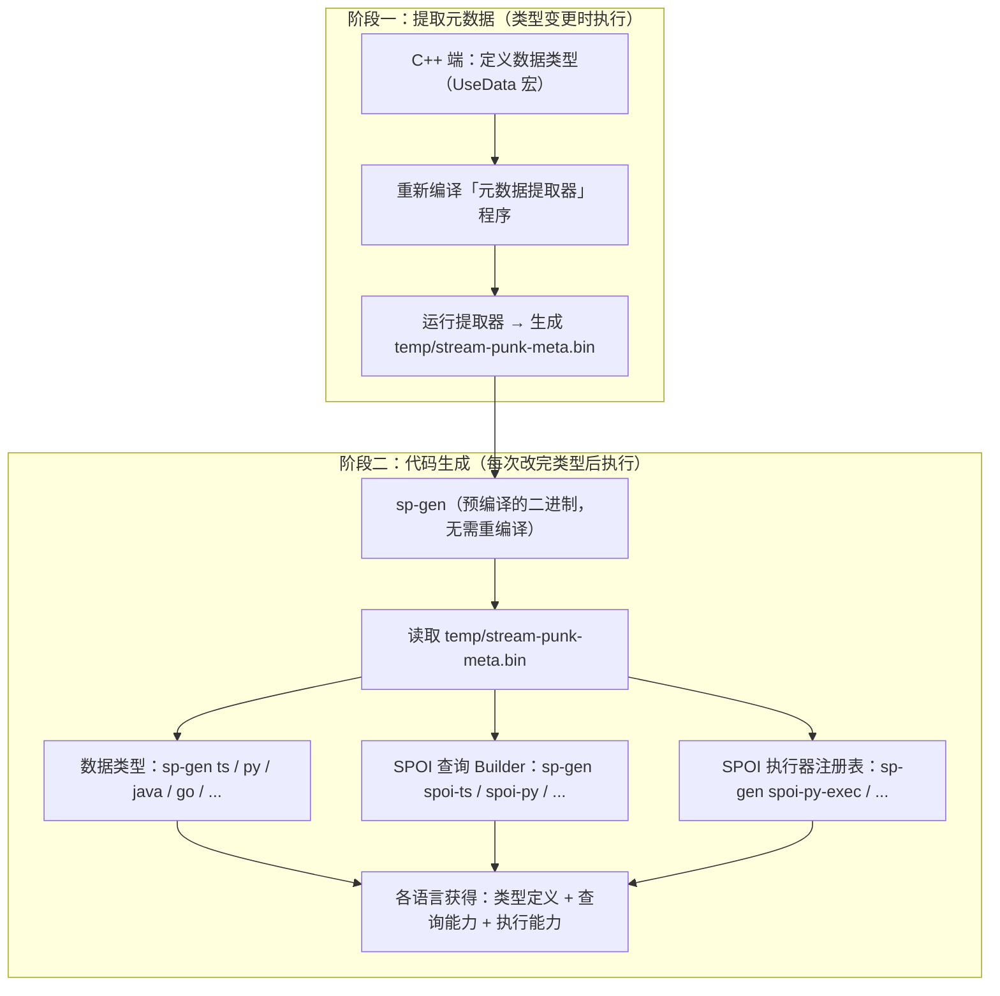

# StreamPunk（流水账）— 跨语言实时数据查询与序列化框架

[](https://en.cppreference.com/w/cpp/20) [](./LICENSE) []() [](./skills/)

StreamPunk 是一个以 C++ 为中心、辐射 8 种语言的跨语言数据互通框架。

**数据全在内存里，直接查，不用数据库。** 当今计算机内存越来越大，把数据放在内存中直接用 SPOI 查询，比走 NoSQL 快得多。数据一边被修改，一边增量更新写入硬盘；需要灵活查询时，还能用内置 ORM 将内存数据存入数据库。

**你所需要做的只是维护好用 C++ 定义的数据类型。** 定义好数据类型后，通过 sp-gen 工具自动生成 Python、Go、Rust、Java、Kotlin、TypeScript、JavaScript 的等价代码，实现各语言之间**实时、自由地动态查询和更新**彼此的数据——无需 C++ 程序参与，任意两个不同语言的程序之间都可以实现数据互通。

> **AI 开箱即用**：本项目包含 11 个 AI Skill 文档，覆盖类型定义、代码生成、SPOI 查询和各语言集成。使用支持 Skill 机制的 AI 编程助手（如 Cursor、Trae）时，AI 会自动加载这些 Skill，无需查阅文档即可正确编写 StreamPunk 代码。[详见 AI 辅助开发](#ai-辅助开发)

**核心能力**：内存直接 SPOI 查询 · 增量更新持久化 · 二进制序列化 · JSON 互转 · 深拷贝 · ORM SQL 生成

---

### 一分钟了解

| 我想... | 怎么做 |
|---------|--------|
| 只序列化 C++ 对象 | [路径 A](#路径-a纯-c-项目) — 继承 `Base`，`UseData` 宏，完事 |
| C++ 服务端 + 多语言客户端 | [路径 B](#路径-bc-跨语言预生成代码模式) — 跑 sp-gen，自动生成各语言类型 |
| 跨语言实时查询对方数据 | [路径 C1](#路径-c1跨语言-spoi-查询) — 构建 SPOI 指令，发二进制流过去查 |
| 字段级增量更新 | [路径 C2](#路径-c2spoi-增量更新shadow-模式) — Shadow 代理，自动生成 SET/ADD/APPEND |
| 类型频繁变化、不想维护代码 | [路径 D](#路径-d动态-schema-解析高级功能) — 发 Schema JSON，运行时适配 |

> **适用场景**：游戏服务端、实时协作工具、IoT 数据交换、微服务跨语言通信——任何需要 C++ 定义数据模型、多语言客户端实时同步的场景。

---

## 目录

- [核心能力](#核心能力)
- [与现有方案对比](#与现有方案对比)
- [架构特点](#架构特点)
- [快速开始](#快速开始)
- [项目结构](#项目结构)
- [AI 辅助开发](#ai-辅助开发)
- [三条使用路径](#三条使用路径按需选择)
  - [路径 A：纯 C++ 项目](#路径-a纯-c-项目)
  - [路径 B：C++ 跨语言（预生成代码模式）](#路径-bc-跨语言预生成代码模式)
  - [路径 C1：跨语言 SPOI 查询](#路径-c1跨语言-spoi-查询)
  - [路径 C2：SPOI 增量更新（Shadow 模式）](#路径-c2spoi-增量更新shadow-模式)
  - [路径 D：动态 Schema 解析](#路径-d动态-schema-解析高级功能)
- [sp-gen 统一命令](#sp-gen-统一命令)
- [编译要求](#编译要求)
- [注意事项](#注意事项)
- [贡献](#贡献)
- [License](#license)

---

## 核心能力

| 能力 | 说明 | 适用场景 |
|------|------|---------|
| **跨语言 SPOI 查询** | 任何语言构建查询指令，发送给其他语言执行并返回结果 | 多个跨语言程序互相查询 |
| **ORM SQL 生成** | 从 C++ 类型自动生成 CREATE/INSERT/UPDATE 语句 | 数据库建表与 CRUD |
| **跨语言增量更新** | 通过 SPOI 指令进行字段级 SET/ADD/APPEND/REMOVE | 游戏状态同步、实时协作编辑 |
| **JSON 支持** | C++ 类型自动生成 toJson/fromJson | 调试、日志、与 REST API 对接 |
| **二进制序列化** | 紧凑的小端序二进制格式，各语言互通 | 网络传输、持久化存储 |
| **深拷贝** | 自动追踪对象引用，避免重复拷贝 | 快照、状态回滚 |

---

## 与现有方案对比

| 能力 | StreamPunk | Protobuf | FlatBuffers | cereal |
|------|:---------:|:--------:|:-----------:|:------:|
| 二进制序列化 | ✅ | ✅ | ✅ | ✅ |
| JSON 互转 | ✅ | ✅ | ✅ | ✅ |
| 深拷贝（对象身份追踪） | ✅ | ❌ | ❌ | ❌ |
| 编译期类型描述符 | ✅ | ❌ | ✅ | ❌ |
| ORM 自动建表 / CRUD | ✅ | ❌ | ❌ | ❌ |
| 内存管道式查询（35 种操作码） | ✅ | ❌ | ❌ | ❌ |
| 跨语言代码生成 | ✅ 8 语言 | ✅ 主流 | ✅ 主流 | ❌ |
| 零外部依赖 | ✅ | ❌ | ❌ | ✅ |
| Header-only | ✅ | ❌ | ✅ | ✅ |
| 可以在 C++ 中直接定义类型 | ✅ | ❌ | ❌ | ✅ |
| Schema 演化 | ❌ | ✅ | ✅ | ❌ |

### 设计亮点

- **一次定义，七种产出**：X 宏定义一次，自动获得序列化、深拷贝、类型描述符、JSON、ORM、SPOI 查询代理、跨语言代码生成。
- **SPOI 管道式查询协议**：35 个操作码，覆盖 filter/sort/select/take/distinct/count/reduce/enumerate/chunk 等，相当于把 C++ `<ranges>` 装进二进制协议。
- **编译期类型描述符**：`TypeDesc<T>` 纯 `constexpr` 递归拼接，零运行时开销。
- **内存直查**：SPOI 直接操作内存对象图，不走 SQL 解析器。
- **指针引用追踪**：`shared_ptr`/`weak_ptr`/`unique_ptr`/裸指针的序列化身份追踪，避免循环引用和重复序列化。
- **提取器 / 生成器分离**：sp-gen 是预编译二进制，改类型只需重编译提取器，sp-gen 本身无需重编译。

---

## 架构特点

StreamPunk 的核心理念是 **C++ 端定义，其他语言自动生成**。整个流程分为两个阶段：



**关键：sp-gen 只需编译一次，不会随类型变更而重编译。** 它运行时从 `temp/stream-punk-meta.bin` 读取类型信息，而元数据文件由独立的「元数据提取器」程序生成。

**改了 C++ 类型 → 重编译提取器 + 重跑 sp-gen → 所有语言自动同步，编译报错提醒遗漏。**

---

## 快速开始

### 环境准备

```bash
git clone https://github.com/aochenxiao/stream-punk.git
cd stream-punk
.\scripts\setup.ps1          # 一键安装依赖 + 编译工具 + 编译所有示例
```

### 手动验证（30 秒）

复制以下代码，编译运行，输出 `Hello StreamPunk` 即表示安装成功：

```cpp
#include <stream-punk/StreamPunk.hpp>

struct Test : public Base {
    #define Xt_Test(X__) X__(std::string, msg, "Hello StreamPunk")
    UseData(Test);
};

int main() {
    INIT_StreamPunk();
    Test t;
    std::cout << t.msg << std::endl;
}
```

### 一键验证

```bash
.\scripts\run-all.ps1        # 一键跑通所有示例
```

---

## 项目结构

详细的项目目录树见 [PROJECT_STRUCTURE.md](./PROJECT_STRUCTURE.md)。

### 关键目录速览

| 目录 | 用途 |
|------|------|
| `include/stream-punk/` | Header-only 核心库，复制到你的 C++ 项目即可用 |
| `tools/sp-gen/` | 统一代码生成器（跨语言），读取元数据 .bin 生成各语言代码 |
| `runtimes/` | 各语言运行时文件，手动复制到目标项目 |
| `skills/` | AI 辅助技能文档——共 11 个 `SKILL.md`，覆盖 C++ 类型定义、sp-gen、SPOI、7 种语言集成 |
| `examples/` | 10 个场景示例，从纯 C++ 序列化到 8 语言全量集成测试 |
| `scripts/` | `setup.ps1` 一键安装，`run-all.ps1` 一键跑所有示例 |

---

## AI 辅助开发

`skills/` 目录下包含 **12 个 AI Skill 文档**（`SKILL.md`），每个覆盖 StreamPunk 的一个核心模块。使用支持 Skill 机制的 AI 编程助手时，这些 Skill 会被自动加载，帮助 AI 准确地理解和使用 StreamPunk。

> 如果你使用 **Cursor**、**Trae** 或其它支持 Skill 的 AI 编程助手，打开本项目后，AI 即可自动识别这些 Skill。无需手动查阅文档，直接描述需求，AI 就能生成正确的代码。

| Skill | 覆盖内容 |
|-------|---------|
| `stream-punk-project-init` | 新建 StreamPunk 项目、CMake 配置、类型定义、sp-gen 集成 |
| `stream-punk-cpp-types` | `UseData` 宏、`Base` 继承、字段定义规范 |
| `stream-punk-meta-extract` | 元数据提取器编译与运行、`.bin` 文件生成 |
| `stream-punk-sp-gen` | sp-gen 命令用法、各语言代码生成 |
| `stream-punk-spoi` | SPOI 操作码、查询 Builder API、执行器注册 |
| `stream-punk-py` | Python 运行时集成、类型映射、SPOI 组件 |
| `stream-punk-ts` | TypeScript 运行时集成、类型映射、SPOI 组件 |
| `stream-punk-js` | JavaScript 运行时集成、类型映射、SPOI 组件 |
| `stream-punk-go` | Go 运行时集成、类型映射、SPOI 组件 |
| `stream-punk-rust` | Rust 运行时集成、类型映射、SPOI 组件 |
| `stream-punk-java` | Java 运行时集成、类型映射、SPOI 组件 |
| `stream-punk-kotlin` | Kotlin 运行时集成、类型映射、SPOI 组件 |

---

## 三条使用路径，按需选择

| 路径 | 适合场景 | 一句话 |
|:----:|----------|--------|
| [A](#路径-a纯-c-项目) | 纯 C++ 序列化 | 继承 `Base`，`UseData` 宏，完事 |
| [B](#路径-bc-跨语言预生成代码模式) | C++ 服务端 + 多语言客户端 | 跑 sp-gen，自动生成各语言代码 |
| [C1](#路径-c1跨语言-spoi-查询) | 跨语言实时查询 | 构建 SPOI 指令，发二进制流过去查 |
| [C2](#路径-c2spoi-增量更新shadow-模式) | 字段级增量更新 | Shadow 代理，自动生成 SET/ADD/APPEND |
| [D](#路径-d动态-schema-解析高级功能) | 类型频繁变化 | 发 Schema JSON，运行时动态适配 |

### 路径 A：纯 C++ 项目

适合：只需要序列化、JSON、深拷贝的 C++ 项目。

```cpp
#include <stream-punk/StreamPunk.hpp>
#include <stream-punk/StreamPunkJson.hpp>

struct Player : public Base {
    #define Xt_Player(X__) \
    X__(std::string, name, "") \
    X__(i32, level, 1) \
    X__(f64, health, 100.0)
    UseData(Player);
    UseDataJson(Player);
};

int main() {
    INIT_StreamPunk();

    Player p{"Alice", 42, 88.5};

    // 二进制序列化
    std::stringstream ss;
    O{ss} << p;
    Player p2; I{ss} >> p2;

    // JSON
    std::cout << p.toJson() << std::endl;

    // 深拷贝
    DeepCopier c; Player p3;
    deepCopy(c, p3, p); c.clear();
}
```

> 完整代码见 `examples/01-basic-cpp/`

### 路径 B：C++ ↔ 跨语言（预生成代码模式）

适合：C++ 服务端 + 其他语言客户端，类型固定，享受编译期类型安全。

**通用流程（7 种语言均适用）：**

```
1. 在 C++ 端用 UseData 宏定义类型
2. 编译运行元数据提取器 → 生成 temp/stream-punk-meta.bin
3. sp-gen -t <语言> -p <输出路径>   → 生成目标语言类型代码
   （使用 -m <path> 可指定非默认路径的元数据文件）
4. 复制 runtimes/<语言>/ 运行时文件到目标项目
5. 目标语言：import 使用，编译期类型检查
```

**各语言具体命令：**

| 语言 | 数据类型生成 | 运行时目录 |
|------|------------|-----------|
| TypeScript | `sp-gen -t ts -p ./data.ts` | `runtimes/ts/` |
| JavaScript | 使用 TS 生成后编译为 JS | `runtimes/js/` |
| Python | `sp-gen -t py-meta -p ./data.py` | `runtimes/py/` |
| Java | `sp-gen -t java-meta -p ./Data.java` | `runtimes/java/` |
| Go | `sp-gen -t go-meta -p ./data.go` | `runtimes/go/` |
| Rust | `sp-gen -t rust-meta -p ./data.rs` | `runtimes/rust/` |
| Kotlin | `sp-gen -t kotlin-meta -p ./Data.kt` | `runtimes/kotlin/` |

**跨语言类型映射：**

| C++ | TS/JS | Python | Java | Go | Rust | Kotlin |
|-----|-------|--------|------|-----|----|--------|
| `i32` | number | int | int | int32 | i32 | Int |
| `i64` | bigint | int | long | int64 | i64 | Long |
| `f64` | number | float | double | float64 | f64 | Double |
| `string` | string | str | String | string | String | String |
| `vector<T>` | Array\<T\> | list[T] | ArrayList\<T\> | []T | Vec\<T\> | MutableList\<T\> |
| `map<K,V>` | Map\<K,V\> | dict | HashMap\<K,V\> | map[K]V | HashMap\<K,V\> | MutableMap\<K,V\> |
| `optional<T>` | T \| null | Optional[T] | T (nullable) | *T | Option\<T\> | T? |


### 路径 C1：跨语言 SPOI 查询

适合：**需要多语言之间实时、动态地互相查询数据**的场景。

SPOI（StreamPunk Operation Instruction）是 StreamPunk 的统一操作指令协议。**任何语言**都可以构建 SPOI 指令流（查询方），发送给**任何其他语言**执行（被查询方），全程只需传递二进制字节流，无需共享内存或序列化整个对象。

#### 查询方：构建 SPOI 指令

各语言通过 sp-gen 生成 SPOI builder，提供类型安全的查询链式 API。以 Python 为例：

```bash
# 生成 Python SPOI 查询 builder
sp-gen -t spoi-py -p ./client/spoi_builder.py
```

```python
from spoi_builder import SpoiQuery, Cmp, SpoiTestPlayer as P

# 构建查询：Player 中 level > 10 的，按 score 降序，取前 5 名
query = SpoiQuery("Player") \
    .filter_i32(P.level, Cmp.GT, 10) \
    .sort(P.score, ascending=False) \
    .take(5) \
    .build()  # 返回 bytes → 通过 TCP/WebSocket 发送给 C++ 服务端
```

所有 7 种非 C++ 语言均支持 SPOI 查询 builder 生成，详见 [sp-gen 统一命令](#sp-gen-统一命令)。

#### 被查询方：执行 SPOI 指令

Python、TypeScript、JavaScript 可以作为 SPOI 服务端，接受来自其他语言的查询指令并执行：

```bash
# 生成执行器注册表 + 复制运行时
sp-gen -t spoi-py-exec -p ./client/stream_punk_registry.py
cp runtimes/py/spoi_executor.py ./client/
```

```python
from stream_punk_registry import TYPE_REGISTRY
from spoi_executor import SpoiExecutor

executor = SpoiExecutor(TYPE_REGISTRY)
result = executor.execute(players, instruction_bytes)  # 执行任意语言发来的 SPOI 指令
```

> 完整代码见 `examples/08-spoi-cross-lang/` 和 `examples/09-spoi-cross-lang-all/`

### 路径 C2：SPOI 增量更新（Shadow 模式）

适合：**需要字段级增量更新，而非全量序列化**的场景。

在 C++ 端，可以通过 SPOI Shadow 代理进行字段级增量更新：

```cpp
#include <stream-punk/StreamPunkSPOIShadow.hpp>

std::stringstream deltaStream;
auto shadow = sp::spoi(player, deltaStream);

shadow.name = "Bob";      // 字段赋值 → 自动缓冲 SET 指令
shadow.score += 10;       // 数值增量 → 自动缓冲 ADD 指令
shadow.items.append("sword"); // 容器追加 → 自动缓冲 APPEND 指令
// shadow 析构时自动将所有指令写入 deltaStream
```

跨语言更新同样支持——其他语言通过 `SpoiUpdate` builder 构建更新指令，发送给 C++ 服务端执行。

> 完整代码见 `examples/08-spoi-cross-lang/`

### 路径 D：动态 Schema 解析（高级功能）

适合：类型频繁变化、对接第三方系统、不想维护生成代码。

```
C++ 端：buildAllSchemas() → 发送 Schema JSON → 客户端用通用解析器解析
Python 端：registry.load_schema(json) → reader.read_any() → 直接使用
```

| 场景 | 预生成模式 | 动态 Schema 模式 |
|------|-----------|-----------------|
| C++ 新增字段 | 重跑 sp-gen，重新编译客户端 | 重发 Schema，自动适配 |
| 对接未知 IoT 设备 | 需要头文件 → 重新生成 | 收到 Schema 即可 |
| 类型安全 | 编译期 | 运行时 |
| 适用场景 | 生产环境，类型稳定 | 开发调试，类型多变 |

> 完整代码见 `examples/03-dynamic-schema/`

---

## sp-gen 统一命令

sp-gen 支持两类目标：**数据类型生成**（将 C++ 类型翻译为其他语言）和 **SPOI 查询生成**（跨语言 SPOI builder）。

```bash
sp-gen -t <目标> -p <输出路径> [-m <元数据文件路径>]
```

`-m` / `--meta` 指定元数据文件路径，默认值为 `temp/stream-punk-meta.bin`。仅对 `-meta` 和 `spoi-*` 目标生效。

### 数据类型生成

```bash
sp-gen ts             # TypeScript
sp-gen ts-meta        # TypeScript（从二进制元数据生成）
sp-gen py             # Python
sp-gen py-meta        # Python（从二进制元数据生成）
sp-gen java           # Java
sp-gen java-meta      # Java（从二进制元数据生成）
sp-gen go-meta        # Go
sp-gen rust-meta      # Rust
sp-gen kotlin-meta    # Kotlin
```

### SPOI 查询生成

```bash
# SPOI 查询/更新 builder（所有 7 种非 C++ 语言）
sp-gen spoi-ts        # TypeScript
sp-gen spoi-py        # Python
sp-gen spoi-java      # Java
sp-gen spoi-go        # Go
sp-gen spoi-rust      # Rust
sp-gen spoi-kotlin    # Kotlin
sp-gen spoi-js        # JavaScript

# 指定自定义元数据文件
sp-gen -t spoi-py -p ./builder.py -m ./my-meta.bin

# SPOI 执行器注册表（让各语言成为被查询方）
sp-gen spoi-py-exec   # Python
sp-gen spoi-ts-exec   # TypeScript
sp-gen spoi-js-exec   # JavaScript
```

### 二进制元数据：为什么能保证正确性？

所有 `-meta` 和 `spoi-*` 模式都从二进制元数据文件读取类型信息。默认路径为 `temp/stream-punk-meta.bin`，可通过 `-m` 选项指定其他路径。该文件由一个独立的「元数据提取器」C++ 程序在编译期生成。

**关键：sp-gen 是预编译的二进制，运行时读取 .bin 文件，不会随类型变更而重编译。** 需要重编译的只有元数据提取器（它 `#include` 了你的类型定义头文件）。

**原理：**

```
customData.hpp 中写:
  UseData(MyStruct, Base, (int, x), (string, name))

         ↓ C++ 编译期宏展开（自动生成）

MyStruct::_className   = "MyStruct"          ← 编译期常量
MyStruct::_baseName    = "Base"              ← 编译期常量
MyStruct::M::TypeList  = tuple<int, string>  ← 编译期类型元组
MyStruct::_membersName = {"x", "name"}       ← 编译期数组
TypeDesc<int>::v       = {1, ...}            ← 编译期 SpToken 数组
TypeDesc<string>::v    = {50, ...}           ← 编译期 SpToken 数组
```

**工作流程：**

```
1. 在 C++ 端用 UseData 宏定义类型
2. 重新编译元数据提取器（#include 了你的类型头文件）→ 运行 → 生成 temp/stream-punk-meta.bin
3. 运行 sp-gen（无需重编译）→ 读取 .bin 文件 → 生成目标语言代码
```

**整个流程由 C++ 编译器保证正确性**——编译通过，元数据就正确；编译报错，类型定义就有问题。无论用户写的类型定义有多复杂（模板嵌套、继承链、variant 等），都不会出现文本解析器那种解析错误。

---

## 编译要求

### C++ 编译器

- **语言标准**：C++20 或更高（推荐 C++23）
- **必须启用 RTTI**
- 已验证编译器：
  - MSVC 2022 (Visual Studio 2022)
  - GCC 12+
  - Clang 16+

### 各语言运行时要求

| 语言 | 最低版本 |
|------|---------|
| TypeScript | 5.x（需安装 `tsc`：`npm install -g typescript`） |
| JavaScript | Node.js 18+ |
| Python | 3.10+ |
| Java | JDK 17+ |
| Go | 1.21+ |
| Rust | 1.75+ |
| Kotlin | 1.9+ |

### 其他约束

- 当前仅支持相同端序架构间的数据互通（小端序）
- 所有文件使用 UTF-8 编码（无 BOM）

---

## 注意事项

### 初始化
- 程序启动时必须运行一次 `INIT_StreamPunk()`
- 切勿修改 `all_custom_creator_pfn` 和 `typeInfo2TypeID` 全局变量

### 类型定义约束
- 所有自定义类必须直接或间接继承 `Base`
- 不建议多继承、菱形继承
- 自定义类默认不使用 `private` 成员；若使用，需为 StreamPunk 声明友元
- 不要用 `std::string_view`、`std::span` 等临时视图类型做成员（可序列化，不可反序列化）
- 不支持宽字节，跨语言推荐使用 `std::u8string` 或 `std::u16string`
- 自定义模板类型建议将特化后注册为独立自定义类

### 指针 — ABA 问题与使用规范

**ABA 问题描述：**

StreamPunk 在序列化和深拷贝时，使用对象的内存地址（`void*`）作为身份标识来追踪对象，避免重复序列化同一对象。当同一个地址被不同的对象复用时，身份追踪会发生混淆，这被称为 **ABA 问题**。

```
场景：
  1. 对象 A 在地址 0x1000 → 深拷贝，DeepCopier 记录 {0x1000 → A}
  2. 对象 A 被释放
  3. 对象 B 在地址 0x1000 分配 → 深拷贝时发现 0x1000 已有记录
     → 错误地将 B 当作 A 的副本，导致数据错乱
```

**防范措施：**
- 深拷贝完成后必须手动调用 `dc.clear()`（`DeepCopier` 不会自动清理）
- 切勿在多个独立的深拷贝操作中复用同一个 `DeepCopier` 实例
- 同样，序列化流 `O` / 反序列化流 `I` 在完成一次完整操作后应调用 `clear()` 重置

**指针使用规范：**

| 场景 | 推荐 | 说明 |
|------|------|------|
| 类内引用 | `Sptr<T>` + `Wptr<T>` | 共享所有权 + 弱引用避免循环 |
| 独占所有权 | `Uptr<T>` + 裸指针 | 独占所有权，裸指针仅引用 |
| 堆分配对象 | 原始指针 | 反序列化自动从堆分配 |
| 首次序列化 | **禁止** `void*` | 无类型信息，无法正确反序列化 |

- 原始指针反序列化时从堆分配新对象，不会指向已有对象——这意味着通过原始指针的"类内引用"在反序列化后会断裂
- `char*` / `char const*` 被当作单个 `char` 对象处理，而非 C 字符串
- 不要使用原始引用（`T&`）作为成员

### 深拷贝
- 使用 `DeepCopier` 对象，拷贝完必须手动 `clear()`
- 涉及 `map` 的深拷贝要求键和值类型支持移动构造

### 序列化
- 使用 `o << std::move(obj)` 时，大部分情况下 `obj` 的数据不会被移走，而是被当作引用处理

---

## 贡献

欢迎提交 Issue 和 Pull Request。提交前请确保：

- 代码通过现有测试
- 新功能包含测试用例
- 遵循项目的代码风格

## 反馈

- [GitHub Issues](https://github.com/aochenxiao/stream-punk/issues)

---

## License

[MIT](./LICENSE) © 2025 aochenxiao