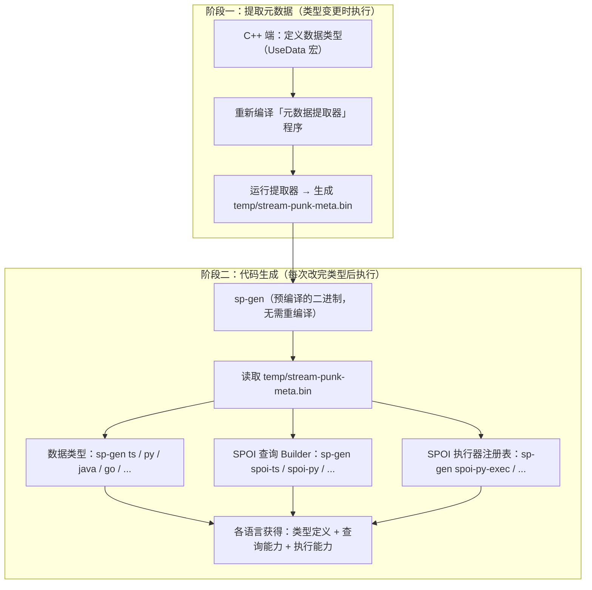

# StreamPunk（狂流）— 跨语言实时数据查询与序列化框架

[](https://en.cppreference.com/w/cpp/20) [](./LICENSE) []() [](./skills/)

---

[](examples/12-gomoku/show/show_gomoku.mp4)

> 五子棋双人对战，C++ 服务端 + React 前端，StreamPunk 二进制序列化实时同步 —— 总共不到 400 行代码。
> 等你看完本文，这种小程序不过是顺手的事。

---

## 你是一个 C++ 程序员，今天你遇到了这些问题...

假设你正在用 C++ 写一个游戏服务端，或者一个实时协作工具，或者一个 IoT 数据网关...

---

### 青铜段位：C++ 里这些重复代码，我不想再写了

你定义了一个 `Player` 结构体，有名字、等级、血量、背包...

```cpp
struct Player {
    std::string name;
    int level;
    double health;
    std::vector<std::string> items;
};
```

然后你需要：
- 存到文件 → 手写二进制序列化/反序列化
- 打日志 → 手写 `toJson()`
- 做快照回滚 → 手写深拷贝（还要处理指针循环引用！）
- 存数据库 → 手写 CREATE TABLE、INSERT、UPDATE 语句

**每加一个字段，上面五处代码都要改，漏改一处就是 Bug。**

这时候你想：**要是我只定义一次结构体，这些代码自动生成就好了。**

---

### 获得新技能：继承 Base，一个宏搞定所有重复劳动

```cpp
#include <stream-punk/StreamPunk.hpp>
#include <stream-punk/StreamPunkJson.hpp>

struct Player : public Base {
    #define Xt_Player(X__) \
    X__(std::string, name, "") \
    X__(i32, level, 1) \
    X__(f64, health, 100.0) \
    X__(vector<string>, items, {})
    UseData(Player);
    UseDataJson(Player);
};
```

然后：

```cpp
int main() {
    INIT_StreamPunk();

    Player p{"Alice", 42, 88.5, {"sword", "shield"}};

    // 二进制序列化（自动处理所有字段）
    std::stringstream ss;
    O{ss} << p;
    Player p2; I{ss} >> p2;

    // JSON（自动生成）
    std::cout << p.toJson() << std::endl;

    // 深拷贝（自动追踪指针，避免循环引用）
    DeepCopier c; Player p3;
    deepCopy(c, p3, p); c.clear();
}
```
序列化、JSON、深拷贝都搞定了，你美滋滋地跑了一个星期。

**纯 C++ 项目，五分钟上手，StreamPunk 全给你自动搞定。**

完整代码见 `examples/01-basic-cpp/`


> **关于宏和 Base 继承的说明**
>
> 你可能会想："宏？好脏。继承 Base？有侵入性。"——我非常理解。
>
> 这是在 **C++20** 标准下的务实工程选择：通过 X 宏在编译期自动生成序列化、JSON、深拷贝的全部样板代码，零运行时开销。
>
> C++26 将引入 **静态反射（static reflection）**，届时可以直接写：
>
>     struct Player {
>         std::string name;
>         int32_t level = 1;
>         double health = 100.0;
>         std::vector<std::string> items;
>     };
>
> 使用方式完全不变：
>
>     Player p{"Alice", 42, 88.5, {"sword", "shield"}};
>     std::stringstream ss;
>     O{ss} << p;
>     Player p2; I{ss} >> p2;
>     std::cout << p.toJson() << std::endl;
>
> **现状：**
> 截至 2026 年，C++26 静态反射仅在 **GCC 16+** 中有实验性实现，**Clang 22.1.8** 以及 **MSVC 2026** 尚未落地。
> 我个人预计 **2029 年之前** 整个 C++ 生态都将处于过渡阶段。
> StreamPunk 当前方案是这个过渡期的最佳选择。
> 我正在积极推进基于反射的零侵入实现。
>
> #### 如何体验（需要 WSL2 + GCC 16）
> 通过 CMake：
> ```bash
> cmake -DBUILD_SP26_REFLECTION=ON -DBUILD_EXAMPLES=ON ..
> cmake --build . --target all-sp26-tests
> cmake --build . --target sp26-example
> ```
>
> **核心设计：** 零宏（无 `UseData`/`DH`）、零侵入（无 `Base` 继承）、二进制兼容现有 StreamPunk 格式。
> 类型注册从几十行宏缩减为一行 `SP_REFLECT(Name, member1, member2, ...)`，等 GCC `nonstatic_data_members_of` 修复后这一行也将移除。


---

### 白银段位：Python 脚本要读数据，总不能手写两份类型吧？

你的 C++ 服务端跑起来了，策划同学写了个 Python 脚本，想读取玩家数据做数据分析。

你面临选择：
1. **用 Protobuf/FlatBuffers**：先写 `.proto` 文件，然后生成 C++ 和 Python 代码——但是你已经在 C++ 里定义好结构体了，还要再维护一份 `.proto`？而且 JSON、深拷贝、ORM 它不管啊。
2. **写 HTTP 接口**：给每个查询需求写一个接口——"查所有等级>10的玩家"、"查血量低于50的玩家"、"按分数排序取前10"... 需求天天变，接口天天加，烦死了。
3. **发整个对象列表**：每次查询把所有玩家序列化成 JSON 发过去，Python 自己过滤——数据量大了卡成 PPT，带宽爆炸。

这时候你想：**能不能 C++ 定义好类型，Python/TypeScript/Go/Java 自动获得一模一样的类型定义？而且不用我手写接口，Python 就能直接"查"我内存里的数据？**

---

### 获得新技能：一条命令，七门编程语言，自动同步类型！

C++ 这边定义好类型后，**只需两步**：

```bash
# 1. 编译运行元数据提取器 → 生成类型信息文件
# 2. 一键生成 Python 代码
sp-gen -t py-meta -p ./data.py
```

然后 Python 端：

```python
from data import Player

# 和 C++ 一模一样的结构体，类型安全
p = Player(name="Alice", level=42, health=88.5, items=["sword", "shield"])
print(p.to_json())  # 同样支持 JSON
```

**支持的语言：**
       

改了 C++ 类型？重跑 `sp-gen`，所有语言自动同步——哪漏改了编译直接报错，不会等到运行时才出问题。

**用法举例：C++ 服务端 + 多语言客户端，类型定义一份维护，全语言自动同步。**

---

### 黄金段位：能不能像查数据库一样，直接查内存里的对象？

现在 Python 能发数据给 C++ 了，但反过来呢？Python 想查："所有等级>10、分数前5的玩家名字"。

如果每次都把所有玩家对象全量序列化发过去：
- 1000 个玩家还好，10 万个玩家呢？
- 只需要 5 个结果，却要传 10 万个对象的全量数据？
- 而且 C++ 内存里明明已经有这些数据了，为什么不能直接在那边查完只返回结果？

你可能会想："要是能像查数据库一样，查内存里的对象就好了，直接发查询请求过去，对方查完返回结果就行。"

**这就是 StreamPunk 的内存查询功能——SPOI。**

---

### 获得新技能：SPOI——二进制查询协议，直接查内存

SPOI（StreamPunk Operation Instruction）是 StreamPunk 的查询协议，相当于把 C++20 的 `<ranges>` 操作装进了二进制流——35 个操作码，filter、sort、select、take、distinct、count、reduce、group... 应有尽有。

**Python 端构建查询（类型安全，链式调用）：**

```bash
sp-gen -t spoi-py -p ./spoi_builder.py  # 生成查询 Builder
```

```python
from spoi_builder import SpoiQuery, Cmp, SpoiTestPlayer as P

# 查：等级>10，按分数降序，取前5名的名字
query = SpoiQuery("Player") \
    .filter_i32(P.level, Cmp.GT, 10) \
    .sort(P.score, ascending=False) \
    .take(5) \
    .select(P.name) \
    .build()  # → 返回 bytes，通过 TCP/WebSocket 发给 C++

# 发送 query... 接收 result_bytes...
```

**C++ 端（或者任何其他语言！）接收并执行：**

```cpp
// 收到 query 字节流，直接在内存玩家列表上执行
SpoiExecutor exec;
auto result = exec.execute(playersList, queryBytes);
// 把 result 发回 Python——只包含5个名字，极小的数据量
```

**重点是：任何语言都可以当查询方，任何语言都可以当被查询方。Python 查 C++、TypeScript 查 Go、Java 查 Rust... 统统可以，全程只传二进制指令和结果，不需要共享内存，不需要序列化整个对象图。**

但 SPOI 也不是万能的。假设运营同学找过来："帮我查一下上个月所有充值超过100块、等级在30级以上、并且上周登录过的玩家，按充值金额排序，导出成 Excel。"

你又懵了：这种跨时间范围、多表联查、聚合统计的需求，总不能把所有历史数据都塞在内存里吧？还是 SQL 更擅长。

这时候 StreamPunk 还自带 ORM——自动生成 SQL 建表和 CRUD 语句，把数据同步到 MySQL，想怎么查就怎么查：

```cpp
    // ORM（自动生成 SQL 建表和 CRUD 语句）
    // 内存里实时操作用 SPOI，需要复杂查询、历史统计的时候，
    // 自动生成 SQL 把数据同步到 MySQL，想怎么查就怎么查
    Player::sqlCreateTable();    // 自动建表
    Player::sqlInsert(p);        // 自动生成 INSERT
```

SPOI 适合查内存里的实时数据（在线玩家、排行榜、当前房间状态），ORM 适合查跨时间范围的历史数据——两个工具各有所长，配合着用就行。

**跨语言 SPOI 实时查询——内存即数据库，直接查，比 NoSQL 还快。**

> 完整代码见
 `examples/08-spoi-cross-lang/` 
 `examples/09-spoi-cross-lang-all/`

---

### 铂金段位：字段改了一点点，没必要传整个对象吧？

玩家捡了一把剑，血量+10，名字改成了"Bob"... 你真的需要把整个 `Player` 对象重新发一遍吗？

如果是实时协作编辑器，10 个人同时改文档，每次都发全量文档？那也太蠢了。

这时候你需要：**只发变更的部分。**

- 名字改了 → SET name = "Bob"
- 血量加了 → ADD health = 10
- 背包多了东西 → APPEND items = "sword"

但是手写这些增量指令？又回到了青铜段位的烦恼——每个字段都要手写，漏了就是 Bug。

---

### 获得新技能：Shadow 模式——像操作普通对象一样写代码，自动生成增量指令

C++ 端：

```cpp
#include <stream-punk/StreamPunkSPOIShadow.hpp>

std::stringstream deltaStream;
auto shadow = sp::spoi(player, deltaStream);  // 套个代理

shadow.name = "Bob";              // 自动记录 SET name
shadow.health += 10;              // 自动记录 ADD health
shadow.items.append("sword");     // 自动记录 APPEND items
// shadow 析构时，所有增量指令自动写入 deltaStream
// 把 deltaStream 发给其他客户端，对方应用同样的增量即可
```

跨语言也一样——Python/TS/Go 端用 `SpoiUpdate` builder 构建更新指令，发给 C++ 执行，字段级增量更新，带宽占用极小。


---
你以为这就完了？

直到某天半夜三点，你被运维的电话吵醒：机房跳闸，服务器断电重启了。

你赶紧登上去一看——坏了，上次全量存盘是凌晨零点，现在三点，这三个小时的玩家数据全丢了。论坛上已经炸锅，充了几万块的大佬回档到三小时前，骂声一片。全量存盘太慢了，10 万玩家序列化一次要好几秒，你总不能每分钟全量存一次吧，卡得玩家动都动不了。

但是用增量更新就简单了：
- 启动时先做一次全量序列化，写入 `snapshot.bin`（基准快照）
- 运行中所有数据变更产生的增量指令，直接 append-only 追加写入 `delta.bin`
- 追加是顺序写，极快，几乎不影响游戏帧率
- 断电重启后，先读 `snapshot.bin` 恢复基准，再依次重放 `delta.bin` 里的增量——最多只丢最后几条没刷盘的，几毫秒的数据，玩家根本感知不到
- 每隔几个小时做一次新的全量快照，清空旧的增量文件，控制大小

这不就是工业界最经典的 WAL 预写日志模式嘛，StreamPunk 的增量更新天然就是干这个的，几行代码就搞定了断电安全。

---
别以为踩完这个坑就没事了。
过了俩月，更糟的事发生了：服务器被黑客入侵，拖走了硬盘上所有数据。

你吓得一身冷汗——玩家数据要是泄露了，这游戏就别开了。结果等安全团队分析完，你松了一口气：黑客拖走的是 `delta.bin`，里面全是 `ADD health = +30`、`SET name = "Bob"`、`APPEND items = "sword"` 这样的相对操作，根本没有任何绝对值。

原来你早就听了建议，把全量快照 `snapshot.bin` 加密后备份在离线存储服务器上，线上机器只留了增量日志。**没有最初的全量基准数据，就算拿到了所有增量，也根本还原不出任何玩家的真实状态。**血量原本是 10 还是 100？不知道。名字原来是什么？不知道。背包里原本有什么？不知道。一堆 `+30`、`-5` 没有任何意义。

增量更新天然只存变化量，相当于自带了一层"差分加密"——不需要你对增量本身做复杂加密，靠数据格式本身就保护了敏感信息。

**SPOI 增量更新——不只是省带宽，断电不丢数据，被拖库也不怕。**

---

### 钻石段位：开发阶段类型天天改，能不能不每次重编译？

前面说的都很好，但有个问题：开发阶段类型天天加字段、改结构，每次改完 C++ 都要重跑 sp-gen，然后 Python/TS/Go 客户端全都要重新拉代码、重新编译、重新部署——策划同学在旁边等得不耐烦了："我就加个测试字段，能不能快点？"

OK，满足你。

---

### 获得新技能：动态 Schema 模式——类型不用预生成，运行时自动适配

C++ 端：
```cpp
std::string schemaJson = buildAllSchemas();  // 一键导出所有类型的 Schema JSON
// 通过 WebSocket 发给所有已连接的客户端
```

Python 端（不需要预生成任何代码！）：
```python
registry.load_schema(schema_json)  # 收到 Schema，运行时直接加载
reader = SpReader(data_bytes, registry)
obj = reader.read_any()  # 直接读出对象，自动适配新字段
print(obj.name, obj.level, obj.new_field)  # 新字段自动有了
```

| 场景 | 预生成代码模式 | 动态 Schema 模式 |
|------|----------------|-----------------|
| C++ 加字段 | 重跑 sp-gen，重编译客户端 | 重发 Schema，自动适配 |
| 类型安全 | 编译期检查 | 运行时检查 |
| 性能 | 最优 | 稍慢（可接受） |
| 适合阶段 | 生产环境，类型稳定 | 开发调试，快速迭代 |

**动态 Schema——开发阶段怎么快怎么来，上线了再切回预生成模式保安全。**

> 完整代码见 `examples/03-dynamic-schema/`

---

## 所以，StreamPunk 到底是什么？

用了 StreamPunk，你只需要用 C++ 定义好数据类型。
剩下的——序列化、JSON、深拷贝、ORM、多语言类型同步、跨语言内存查询、字段级增量更新——StreamPunk 全包了。

从简单到复杂，按需使用：

| 你想... | 怎么做 | 难度 |
|---------|-------|:----:|
| C++ 里序列化/JSON/深拷贝不想手写 | 继承 `Base` + `UseData`，一个宏搞定 | 简单 |
| 实时查内存用 SPOI，复杂历史数据落库用 ORM | 自动生成 SQL，同步到 MySQL，两个工具配合用 | 简单 |
| C++ 类型要给 Python/TS/Go 用，不想手写多份 | `sp-gen` 自动生成 7 语言代码 | 中等 |
| 多语言程序之间想实时查对方内存数据 | SPOI 查询协议，二进制发指令 | 较难 |
| 省带宽 + 断电不丢数据 + 被拖库也不怕 | SPOI Shadow 增量更新 + WAL 持久化 + 差分加密 | 较难 |
| 开发阶段类型天天改，懒得每次重生成 | 动态 Schema 运行时自动适配 | 中等 |

**适用场景**：游戏服务端、实时协作工具、IoT 数据交换、微服务跨语言通信——任何需要 C++ 定义数据模型、多语言客户端实时同步的场景。

---

> **AI 开箱即用**：
本项目包含 14 个 AI Skill 文档，覆盖类型定义、代码生成、SPOI 查询和各语言集成。
使用支持 Skill 机制的 AI 编程助手（如 Cursor、Trae）时，AI 会自动加载这些 Skill，无需查阅文档即可正确编写 StreamPunk 代码。
[详见 AI 辅助开发](#ai-辅助开发)

> **核心能力一览**：
内存直接 SPOI 查询 · 增量更新持久化 · 二进制序列化 · JSON 互转 · 深拷贝 · ORM SQL 生成

---

## 目录

- [核心能力详解](#核心能力详解)
- [与现有方案对比](#与现有方案对比)
- [架构特点](#架构特点)
- [快速开始](#快速开始)
- [项目结构](#项目结构)
- [AI 辅助开发](#ai-辅助开发)
- [使用方式详解](#使用方式详解)
  - [纯 C++ 项目](#纯-c-项目)
  - [C++ 跨语言（预生成代码模式）](#c-跨语言预生成代码模式)
  - [跨语言 SPOI 查询](#跨语言-spoi-查询)
  - [SPOI 增量更新（Shadow 模式）](#spoi-增量更新shadow-模式)
  - [动态 Schema 解析（高级功能）](#动态-schema-解析高级功能)
- [sp-gen 统一命令](#sp-gen-统一命令)
- [编译要求](#编译要求)
- [注意事项](#注意事项)
- [贡献](#贡献)
- [License](#license)

---

## 核心能力详解

| 能力 | 说明 | 适用场景 |
|------|------|---------|
| **跨语言 SPOI 查询** | 任何语言构建查询指令，发送给其他语言执行并返回结果；内存直查，比 SQL 快 | 多语言程序互相实时查询、简单过滤/排序/聚合、实时排行榜 |
| **ORM SQL 生成** | 从 C++ 类型自动生成 CREATE/INSERT/UPDATE 语句；和 SPOI 配合，实时数据内存查，历史数据落库查 | 复杂联表查询、历史数据分析、充值流水统计、需要落盘到 MySQL/SQLite |
| **跨语言增量更新** | 字段级 SET/ADD/APPEND/REMOVE；全量快照+增量追加实现 WAL 断电安全；增量只存相对值天然差分加密 | 游戏状态同步、实时协作编辑、实时数据持久化、防数据泄露 |
| **JSON 支持** | C++ 类型自动生成 toJson/fromJson | 调试、日志、与 REST API 对接 |
| **二进制序列化** | 紧凑的小端序二进制格式，各语言互通 | 网络传输、持久化全量快照 |
| **深拷贝** | 自动追踪对象引用，避免循环引用和重复拷贝 | 快照、状态回滚 |

---

## 与现有方案对比

| 能力 | StreamPunk | Protobuf | FlatBuffers | cereal |
|------|:---------:|:--------:|:-----------:|:------:|
| 二进制序列化 | ✅ | ✅ | ✅ | ✅ |
| JSON 互转 | ✅ | ✅ | ✅ | ✅ |
| 深拷贝（对象身份追踪） | ✅ | ❌ | ❌ | ❌ |
| 编译期类型描述符 | ✅ | ❌ | ✅ | ❌ |
| ORM 自动建表 / CRUD | ✅ | ❌ | ❌ | ❌ |
| 内存管道式查询（35 种操作码） | ✅ | ❌ | ❌ | ❌ |
| 跨语言代码生成 | ✅ 8 语言 | ✅ 主流 | ✅ 主流 | ❌ |
| 零外部依赖 | ✅ | ❌ | ❌ | ✅ |
| Header-only | ✅ | ❌ | ✅ | ✅ |
| 可以在 C++ 中直接定义类型 | ✅ | ❌ | ❌ | ✅ |
| Schema 演化 | ❌ | ✅ | ✅ | ❌ |

### 设计亮点

- **一次定义，七种产出**：X 宏定义一次，自动获得序列化、深拷贝、类型描述符、JSON、ORM、SPOI 查询代理、跨语言代码生成。
- **SPOI 管道式查询协议**：35 个操作码，覆盖 filter/sort/select/take/distinct/count/reduce/enumerate/chunk 等，相当于把 C++ `<ranges>` 装进二进制协议。
- **编译期类型描述符**：`TypeDesc<T>` 纯 `constexpr` 递归拼接，零运行时开销。
- **内存直查**：SPOI 直接操作内存对象图，不走 SQL 解析器。
- **指针引用追踪**：`shared_ptr`/`weak_ptr`/`unique_ptr`/裸指针的序列化身份追踪，避免循环引用和重复序列化。
- **提取器 / 生成器分离**：sp-gen 是预编译二进制，改类型只需重编译提取器，sp-gen 本身无需重编译。

---

## 架构特点

StreamPunk 的核心理念是 **C++ 端定义，其他语言自动生成**。整个流程分为两个阶段：



**关键：sp-gen 只需编译一次，不会随类型变更而重编译。** 它运行时从 `temp/stream-punk-meta.bin` 读取类型信息，而元数据文件由独立的「元数据提取器」程序生成。

**改了 C++ 类型 → 重编译提取器 + 重跑 sp-gen → 所有语言自动同步，编译报错提醒遗漏。**

---

## 快速开始

### 环境准备

```bash
git clone https://github.com/aochenxiao/stream-punk.git
cd stream-punk
.\scripts\setup.ps1          # 一键安装依赖 + 编译工具 + 编译所有示例
```

### 手动验证（30 秒）

复制以下代码，编译运行，输出 `Hello StreamPunk` 即表示安装成功：

```cpp
#include <stream-punk/StreamPunk.hpp>

struct Test : public Base {
    #define Xt_Test(X__) X__(std::string, msg, "Hello StreamPunk")
    UseData(Test);
};

int main() {
    INIT_StreamPunk();
    Test t;
    std::cout << t.msg << std::endl;
}
```

### 一键验证

```bash
.\scripts\run-all.ps1        # 一键跑通所有示例
```

---

## 项目结构

详细的项目目录树见 [PROJECT_STRUCTURE.md](./PROJECT_STRUCTURE.md)。

### 关键目录速览

| 目录 | 用途 |
|------|------|
| `include/stream-punk/` | Header-only 核心库，复制到你的 C++ 项目即可用 |
| `tools/sp-gen/` | 统一代码生成器（跨语言），读取元数据 .bin 生成各语言代码 |
| `runtimes/` | 各语言运行时文件，手动复制到目标项目 |
| `skills/` | AI 辅助技能文档——共 14 个 `SKILL.md`，覆盖 C++ 类型定义、sp-gen、SPOI、7 种语言集成 |
| `examples/` | 14 个场景示例，从纯 C++ 序列化到多语言微服务网格 |
| `scripts/` | `setup.ps1` 一键安装，`run-all.ps1` 一键跑所有示例 |

---

## AI 辅助开发

`skills/` 目录下包含 **14 个 AI Skill 文档**（`SKILL.md`），每个覆盖 StreamPunk 的一个核心模块。使用支持 Skill 机制的 AI 编程助手时，这些 Skill 会被自动加载，帮助 AI 准确地理解和使用 StreamPunk。

> 如果你使用 **Cursor**、**Trae** 或其它支持 Skill 的 AI 编程助手，打开本项目后，AI 即可自动识别这些 Skill。无需手动查阅文档，直接描述需求，AI 就能生成正确的代码。

| Skill | 覆盖内容 |
|-------|---------|
| `stream-punk-project-init` | 新建 StreamPunk 项目、CMake 配置、类型定义、sp-gen 集成 |
| `stream-punk-cpp-types` | `UseData` 宏、`Base` 继承、字段定义规范 |
| `stream-punk-meta-extract` | 元数据提取器编译与运行、`.bin` 文件生成 |
| `stream-punk-sp-gen` | sp-gen 命令用法、各语言代码生成 |
| `stream-punk-spoi` | SPOI 操作码、查询 Builder API、执行器注册 |
| `stream-punk-py` | Python 运行时集成、类型映射、SPOI 组件 |
| `stream-punk-ts` | TypeScript 运行时集成、类型映射、SPOI 组件 |
| `stream-punk-js` | JavaScript 运行时集成、类型映射、SPOI 组件 |
| `stream-punk-go` | Go 运行时集成、类型映射、SPOI 组件 |
| `stream-punk-rust` | Rust 运行时集成、类型映射、SPOI 组件 |
| `stream-punk-java` | Java 运行时集成、类型映射、SPOI 组件 |
| `stream-punk-kotlin` | Kotlin 运行时集成、类型映射、SPOI 组件 |

---

## 使用方式详解

| 适合场景 | 一句话 |
|----------|--------|
| 纯 C++ 序列化 | 继承 `Base`，`UseData` 宏，完事 |
| C++ 服务端 + 多语言客户端 | 跑 sp-gen，自动生成各语言代码 |
| 跨语言实时查询 | 构建 SPOI 指令，发二进制流过去查 |
| 字段级增量更新 | Shadow 代理，自动生成 SET/ADD/APPEND |
| 类型频繁变化 | 发 Schema JSON，运行时动态适配 |

### 纯 C++ 项目

适合：只需要序列化、JSON、深拷贝的 C++ 项目。

```cpp
#include <stream-punk/StreamPunk.hpp>
#include <stream-punk/StreamPunkJson.hpp>

struct Player : public Base {
    #define Xt_Player(X__) \
    X__(std::string, name, "") \
    X__(i32, level, 1) \
    X__(f64, health, 100.0)
    UseData(Player);
    UseDataJson(Player);
};

int main() {
    INIT_StreamPunk();

    Player p{"Alice", 42, 88.5};

    // 二进制序列化
    std::stringstream ss;
    O{ss} << p;
    Player p2; I{ss} >> p2;

    // JSON
    std::cout << p.toJson() << std::endl;

    // 深拷贝
    DeepCopier c; Player p3;
    deepCopy(c, p3, p); c.clear();
}
```

> 完整代码见 `examples/01-basic-cpp/`

### C++ 跨语言（预生成代码模式）

适合：C++ 服务端 + 其他语言客户端，类型固定，享受编译期类型安全。

**通用流程（7 种语言均适用）：**

```
1. 在 C++ 端用 UseData 宏定义类型
2. 编译运行元数据提取器 → 生成 temp/stream-punk-meta.bin
3. sp-gen -t <语言> -p <输出路径>   → 生成目标语言类型代码
   （使用 -m <path> 可指定非默认路径的元数据文件）
4. 复制 runtimes/<语言>/ 运行时文件到目标项目
5. 目标语言：import 使用，编译期类型检查
```

**各语言具体命令：**

| 语言 | 数据类型生成 | 运行时目录 |
|------|------------|-----------|
| TypeScript | `sp-gen -t ts -p ./data.ts` | `runtimes/ts/` |
| JavaScript | 使用 TS 生成后编译为 JS | `runtimes/js/` |
| Python | `sp-gen -t py-meta -p ./data.py` | `runtimes/py/` |
| Java | `sp-gen -t java-meta -p ./Data.java` | `runtimes/java/` |
| Go | `sp-gen -t go-meta -p ./data.go` | `runtimes/go/` |
| Rust | `sp-gen -t rust-meta -p ./data.rs` | `runtimes/rust/` |
| Kotlin | `sp-gen -t kotlin-meta -p ./Data.kt` | `runtimes/kotlin/` |

**跨语言类型映射：**

| C++ | TS/JS | Python | Java | Go | Rust | Kotlin |
|-----|-------|--------|------|-----|----|--------|
| `i32` | number | int | int | int32 | i32 | Int |
| `i64` | bigint | int | long | int64 | i64 | Long |
| `f64` | number | float | double | float64 | f64 | Double |
| `string` | string | str | String | string | String | String |
| `vector<T>` | Array\<T\> | list[T] | ArrayList\<T\> | []T | Vec\<T\> | MutableList\<T\> |
| `map<K,V>` | Map\<K,V\> | dict | HashMap\<K,V\> | map[K]V | HashMap\<K,V\> | MutableMap\<K,V\> |
| `optional<T>` | T \| null | Optional[T] | T (nullable) | *T | Option\<T\> | T? |


### 跨语言 SPOI 查询

适合：**需要多语言之间实时、动态地互相查询数据**的场景。

SPOI（StreamPunk Operation Instruction）是 StreamPunk 的统一操作指令协议。**任何语言**都可以构建 SPOI 指令流（查询方），发送给**任何其他语言**执行（被查询方），全程只需传递二进制字节流，无需共享内存或序列化整个对象。

#### 查询方：构建 SPOI 指令

各语言通过 sp-gen 生成 SPOI builder，提供类型安全的查询链式 API。以 Python 为例：

```bash
# 生成 Python SPOI 查询 builder
sp-gen -t spoi-py -p ./client/spoi_builder.py
```

```python
from spoi_builder import SpoiQuery, Cmp, SpoiTestPlayer as P

# 构建查询：Player 中 level > 10 的，按 score 降序，取前 5 名
query = SpoiQuery("Player") \
    .filter_i32(P.level, Cmp.GT, 10) \
    .sort(P.score, ascending=False) \
    .take(5) \
    .build()  # 返回 bytes → 通过 TCP/WebSocket 发送给 C++ 服务端
```

所有 7 种非 C++ 语言均支持 SPOI 查询 builder 生成，详见 [sp-gen 统一命令](#sp-gen-统一命令)。

#### 被查询方：执行 SPOI 指令

Python、TypeScript、JavaScript 可以作为 SPOI 服务端，接受来自其他语言的查询指令并执行：

```bash
# 生成执行器注册表 + 复制运行时
sp-gen -t spoi-py-exec -p ./client/stream_punk_registry.py
cp runtimes/py/spoi_executor.py ./client/
```

```python
from stream_punk_registry import TYPE_REGISTRY
from spoi_executor import SpoiExecutor

executor = SpoiExecutor(TYPE_REGISTRY)
result = executor.execute(players, instruction_bytes)  # 执行任意语言发来的 SPOI 指令
```

> 完整代码见 `examples/08-spoi-cross-lang/` 和 `examples/09-spoi-cross-lang-all/`

### SPOI 增量更新（Shadow 模式）

适合：**需要字段级增量更新，而非全量序列化**的场景。

在 C++ 端，可以通过 SPOI Shadow 代理进行字段级增量更新：

```cpp
#include <stream-punk/StreamPunkSPOIShadow.hpp>

std::stringstream deltaStream;
auto shadow = sp::spoi(player, deltaStream);

shadow.name = "Bob";      // 字段赋值 → 自动缓冲 SET 指令
shadow.score += 10;       // 数值增量 → 自动缓冲 ADD 指令
shadow.items.append("sword"); // 容器追加 → 自动缓冲 APPEND 指令
// shadow 析构时自动将所有指令写入 deltaStream
```

跨语言更新同样支持——其他语言通过 `SpoiUpdate` builder 构建更新指令，发送给 C++ 服务端执行。

> 完整代码见 `examples/08-spoi-cross-lang/`

### 动态 Schema 解析（高级功能）

适合：类型频繁变化、对接第三方系统、不想维护生成代码。

```
C++ 端：buildAllSchemas() → 发送 Schema JSON → 客户端用通用解析器解析
Python 端：registry.load_schema(json) → reader.read_any() → 直接使用
```

| 场景 | 预生成代码模式 | 动态 Schema 模式 |
|------|----------------|-----------------|
| C++ 新增字段 | 重跑 sp-gen，重新编译客户端 | 重发 Schema，自动适配 |
| 对接未知 IoT 设备 | 需要头文件 → 重新生成 | 收到 Schema 即可 |
| 类型安全 | 编译期 | 运行时 |
| 适用场景 | 生产环境，类型稳定 | 开发调试，类型多变 |

> 完整代码见 `examples/03-dynamic-schema/`

---

## sp-gen 统一命令

sp-gen 支持两类目标：**数据类型生成**（将 C++ 类型翻译为其他语言）和 **SPOI 查询生成**（跨语言 SPOI builder）。

```bash
sp-gen -t <目标> -p <输出路径> [-m <元数据文件路径>]
```

`-m` / `--meta` 指定元数据文件路径，默认值为 `temp/stream-punk-meta.bin`。仅对 `-meta` 和 `spoi-*` 目标生效。

### 数据类型生成

```bash
sp-gen ts             # TypeScript
sp-gen ts-meta        # TypeScript（从二进制元数据生成）
sp-gen py             # Python
sp-gen py-meta        # Python（从二进制元数据生成）
sp-gen java           # Java
sp-gen java-meta      # Java（从二进制元数据生成）
sp-gen go-meta        # Go
sp-gen rust-meta      # Rust
sp-gen kotlin-meta    # Kotlin
```

### SPOI 查询生成

```bash
# SPOI 查询/更新 builder（所有 7 种非 C++ 语言）
sp-gen spoi-ts        # TypeScript
sp-gen spoi-py        # Python
sp-gen spoi-java      # Java
sp-gen spoi-go        # Go
sp-gen spoi-rust      # Rust
sp-gen spoi-kotlin    # Kotlin
sp-gen spoi-js        # JavaScript

# 指定自定义元数据文件
sp-gen -t spoi-py -p ./builder.py -m ./my-meta.bin

# SPOI 执行器注册表（让各语言成为被查询方）
sp-gen spoi-py-exec   # Python
sp-gen spoi-ts-exec   # TypeScript
sp-gen spoi-js-exec   # JavaScript
```

### 二进制元数据：为什么能保证正确性？

所有 `-meta` 和 `spoi-*` 模式都从二进制元数据文件读取类型信息。默认路径为 `temp/stream-punk-meta.bin`，可通过 `-m` 选项指定其他路径。该文件由一个独立的「元数据提取器」C++ 程序在编译期生成。

**关键：sp-gen 是预编译的二进制，运行时读取 .bin 文件，不会随类型变更而重编译。** 需要重编译的只有元数据提取器（它 `#include` 了你的类型定义头文件）。

**原理：**

```
customData.hpp 中写:
  UseData(MyStruct, Base, (int, x), (string, name))

         ↓ C++ 编译期宏展开（自动生成）

MyStruct::_className   = "MyStruct"          ← 编译期常量
MyStruct::_baseName    = "Base"              ← 编译期常量
MyStruct::M::TypeList  = tuple<int, string>  ← 编译期类型元组
MyStruct::_membersName = {"x", "name"}       ← 编译期数组
TypeDesc<int>::v       = {1, ...}            ← 编译期 SpToken 数组
TypeDesc<string>::v    = {50, ...}           ← 编译期 SpToken 数组
```

**工作流程：**

```
1. 在 C++ 端用 UseData 宏定义类型
2. 重新编译元数据提取器（#include 了你的类型头文件）→ 运行 → 生成 temp/stream-punk-meta.bin
3. 运行 sp-gen（无需重编译）→ 读取 .bin 文件 → 生成目标语言代码
```

**整个流程由 C++ 编译器保证正确性**——编译通过，元数据就正确；编译报错，类型定义就有问题。无论用户写的类型定义有多复杂（模板嵌套、继承链、variant 等），都不会出现文本解析器那种解析错误。

---

## 运行示例

StreamPunk 包含多个**前后端分离**的可视化示例，由 C++ WebSocket 服务端 + 前端 SPA 组成。

### 前置要求

- **C++ 编译器**：Visual Studio 2022（已安装 C++ 桌面开发工作负载）
- **Node.js 18+**：前端开发服务器需要，从 [nodejs.org](https://nodejs.org/) 下载
- **npm**：随 Node.js 一同安装，用于安装前端依赖

### 编译服务端

确保已执行 `.\scripts\setup.ps1` 安装依赖，然后：

```bash
# 在项目根目录执行
cmake --build build --target stream-worms-server    # 示例 10：百战天虫
cmake --build build --target whiteboard-server      # 示例 13：协同画板
cmake --build build --target gomoku-server          # 示例 12：五子棋
cmake --build build --target tank-battle-server     # 示例 14：坦克大战
cmake --build build --target restaurant-server      # 示例 15：餐厅管理
```

或一次性编译所有示例：

```bash
cmake --build build
```

### 运行各示例

每个示例均需**先启动 C++ 服务端，再启动前端**。需要两个终端窗口：

| 终端 | 用途 |
|:---:|------|
| 终端 1 | 运行 C++ 服务端（保持运行，不要关闭） |
| 终端 2 | 运行前端开发服务器，然后在浏览器中打开页面 |

#### 示例 10：StreamWorms（百战天虫）

3D 游戏，使用 Three.js 渲染，展示 StreamPunk 跨语言对象同步。

```bash
# ── 终端 1：启动服务端（端口 9999）──
.\build\examples\10-game\Debug\stream-worms-server.exe

# ── 终端 2：启动前端（端口 3000）──
cd examples\10-game\client
npm install         # 首次运行需要，安装依赖
npm run dev
# 浏览器打开 http://localhost:3000
```

> 多人测试：打开两个浏览器标签页，分别输入玩家名加入游戏，即可看到双方实时同步。

#### 示例 12：五子棋

双人五子棋对弈，展示 StreamPunk 二进制序列化实时同步。

```bash
# ── 终端 1：启动服务端（端口 9003）──
.\build\examples\12-gomoku\server\Debug\gomoku-server.exe

# ── 终端 2：启动前端（端口 5175）──
cd examples\12-gomoku\client
npm install
npm run dev
# 浏览器打开 http://localhost:5175
```

> 多人测试：打开两个浏览器标签页，分别点击"加入游戏"，即可开始对弈。

#### 示例 13：协同画板

多人实时白板，展示 SPOI Shadow 增量同步（笔画只传增量，不重发全量）。

```bash
# ── 终端 1：启动服务端（端口 9998）──
.\build\examples\13-whiteboard\Debug\whiteboard-server.exe

# ── 终端 2：启动前端（端口 5173）──
cd examples\13-whiteboard\client
npm install
npm run dev
# 浏览器打开 http://localhost:5173
```

> 多人测试：打开两个浏览器标签页，输入不同昵称加入同一房间，画板上可以看到双方的笔迹实时同步。

#### 示例 14：坦克大战

双人坦克对战，展示 StreamPunk 实时状态同步。

```bash
# ── 终端 1：启动服务端（端口 9002）──
.\build\examples\14-tank-battle\server\Debug\tank-battle-server.exe

# ── 终端 2：启动前端（端口 5174）──
cd examples\14-tank-battle\client
npm install
npm run dev
# 浏览器打开 http://localhost:5174
```

> 多人测试：打开两个浏览器标签页，分别点击"加入游戏"，用 WASD/方向键控制坦克移动，空格射击。

#### 示例 15：餐厅管理系统

多角色餐厅管理（老板、服务员、厨房、收银等），展示 StreamPunk 复杂业务状态同步。

```bash
# ── 终端 1：启动服务端（端口 9004）──
.\build\examples\15-restaurant\server\Debug\restaurant-server.exe

# ── 终端 2：启动前端（端口 5176）──
cd examples\15-restaurant\client
npm install
npm run dev
# 浏览器打开 http://localhost:5176
```

> 多人测试：打开多个浏览器标签页，分别选择不同角色（服务员、厨房、收银等）登录，观察各角色视图的实时联动。

#### 示例 16：协作编辑器（需 ixwebsocket）

多人实时文本协作编辑，展示 StreamPunk 增量更新。

```bash
# 需要先安装 ixwebsocket（vcpkg install ixwebsocket）
cmake -S examples\16-collab-editor\server -B build\collab-editor-server
cmake --build build\collab-editor-server

# ── 终端 1：启动服务端（端口 9005）──
.\build\collab-editor-server\Debug\collab-server.exe

# ── 终端 2：启动前端（端口 5177）──
cd examples\16-collab-editor\client
npm install
npm run dev
# 浏览器打开 http://localhost:5177
```

> 多人测试：打开两个浏览器标签页，输入不同用户名加入，编辑文本可以看到对方的光标位置和内容实时同步。

#### 示例 07：全栈演示（需 Drogon）

Vue 3 + C++ 全栈，展示二进制数据流可视化和浮动光标实时同步。

```bash
# 需要先安装 Drogon 框架（vcpkg install drogon）
cmake -S examples\07-full-stack\server -B build\full-stack-server
cmake --build build\full-stack-server

# ── 终端 1：启动服务端（端口 12345）──
.\build\full-stack-server\Debug\WebSocketEchoServer.exe

# ── 终端 2：启动前端（端口 9625）──
cd examples\07-full-stack\client
npm install
npm run dev
# 浏览器打开 http://localhost:9625
```

> **提示**：`07-full-stack` 需要 Drogon，`16-collab-editor` 需要 ixwebsocket，请先通过 vcpkg 安装相应依赖后再编译。

### 控制台示例（无外部依赖）

以下示例为纯 C++ 控制台程序，无需 Node.js 或外部库，编译即运行。

#### 示例 17：WAL 持久化与断电恢复

演示 StreamPunk 增量更新实现 WAL（预写日志）模式：全量快照 + 增量追加 → 断电恢复 → 差分加密。

```bash
# 编译
cmake --build build --target example-17-wal-persistence

# 运行
.\build\examples\17-wal-persistence\Debug\example-17-wal-persistence.exe
```

> 展示功能：增量更新、快照持久化、WAL 恢复、差分安全

#### 示例 18：IoT 传感器数据采集与分析

模拟 IoT 传感器网关，展示二进制序列化（紧凑数据）、SPOI 查询（过滤异常）和动态 Schema（新传感器类型适配）。

```bash
# 编译
cmake --build build --target example-18-iot-sensor

# 运行
.\build\examples\18-iot-sensor\Debug\example-18-iot-sensor.exe
```

> 展示功能：二进制序列化 vs JSON 对比、SPOI 查询、动态 Schema、跨语言生成

#### 示例 19：实时排行榜系统

游戏排行榜场景，展示 SPOI 查询（Top-N 排序、多条件过滤）和增量更新（分数变化只传增量）。

```bash
# 编译
cmake --build build --target example-19-leaderboard

# 运行
.\build\examples\19-leaderboard\Debug\example-19-leaderboard.exe
```

> 展示功能：SPOI filter/sort/take/count、增量更新、跨语言数据交换

#### 示例 20：多语言微服务网格

模拟 C++ 认证服务 + Python 分析服务 + Go API 网关的微服务架构，展示跨语言 SPOI 互相查询。

```bash
# 编译
cmake --build build --target example-20-microservice-mesh

# 运行
.\build\examples\20-microservice-mesh\Debug\example-20-microservice-mesh.exe
```

> 展示功能：跨语言 SPOI 互查、二进制协议、类型安全、微服务治理

---

## 编译要求

### C++ 编译器

- **语言标准**：C++20 或更高（推荐 C++23）
- **必须启用 RTTI**
- 已验证编译器：
  - MSVC 2022 (Visual Studio 2022)
  - GCC 12+
  - Clang 16+

### 各语言运行时要求

| 语言 | 最低版本 |
|------|---------|
| TypeScript | 5.x（需安装 `tsc`：`npm install -g typescript`） |
| JavaScript | Node.js 18+ |
| Python | 3.10+ |
| Java | JDK 17+ |
| Go | 1.21+ |
| Rust | 1.75+ |
| Kotlin | 1.9+ |

### 其他约束

- 当前仅支持相同端序架构间的数据互通（小端序）
- 所有文件使用 UTF-8 编码（无 BOM）

---

## 注意事项

### 初始化
- 程序启动时必须运行一次 `INIT_StreamPunk()`
- 切勿修改 `all_custom_creator_pfn` 和 `typeInfo2TypeID` 全局变量

### 类型定义约束
- 所有自定义类必须直接或间接继承 `Base`
- 不建议多继承、菱形继承
- 自定义类默认不使用 `private` 成员；若使用，需为 StreamPunk 声明友元
- 不要用 `std::string_view`、`std::span` 等临时视图类型做成员（可序列化，不可反序列化）
- 不支持宽字节，跨语言推荐使用 `std::u8string` 或 `std::u16string`
- 自定义模板类型建议将特化后注册为独立自定义类

### 指针 — ABA 问题与使用规范

**ABA 问题描述：**

StreamPunk 在序列化和深拷贝时，使用对象的内存地址（`void*`）作为身份标识来追踪对象，避免重复序列化同一对象。当同一个地址被不同的对象复用时，身份追踪会发生混淆，这被称为 **ABA 问题**。

```
场景：
  1. 对象 A 在地址 0x1000 → 深拷贝，DeepCopier 记录 {0x1000 → A}
  2. 对象 A 被释放
  3. 对象 B 在地址 0x1000 分配 → 深拷贝时发现 0x1000 已有记录
     → 错误地将 B 当作 A 的副本，导致数据错乱
```

**防范措施：**
- 深拷贝完成后必须手动调用 `dc.clear()`（`DeepCopier` 不会自动清理）
- 切勿在多个独立的深拷贝操作中复用同一个 `DeepCopier` 实例
- 同样，序列化流 `O` / 反序列化流 `I` 在完成一次完整操作后应调用 `clear()` 重置

**指针使用规范：**

| 场景 | 推荐 | 说明 |
|------|------|------|
| 类内引用 | `Sptr<T>` + `Wptr<T>` | 共享所有权 + 弱引用避免循环 |
| 独占所有权 | `Uptr<T>` + 裸指针 | 独占所有权，裸指针仅引用 |
| 堆分配对象 | 原始指针 | 反序列化自动从堆分配 |
| 首次序列化 | **禁止** `void*` | 无类型信息，无法正确反序列化 |

- 原始指针反序列化时从堆分配新对象，不会指向已有对象——这意味着通过原始指针的"类内引用"在反序列化后会断裂
- `char*` / `char const*` 被当作单个 `char` 对象处理，而非 C 字符串
- 不要使用原始引用（`T&`）作为成员

### 深拷贝
- 使用 `DeepCopier` 对象，拷贝完必须手动 `clear()`
- 涉及 `map` 的深拷贝要求键和值类型支持移动构造

### 序列化
- 使用 `o << std::move(obj)` 时，大部分情况下 `obj` 的数据不会被移走，而是被当作引用处理

---

## 贡献

欢迎提交 Issue 和 Pull Request。提交前请确保：

- 代码通过现有测试
- 新功能包含测试用例
- 遵循项目的代码风格

## 反馈

- [GitHub Issues](https://github.com/aochenxiao/stream-punk/issues)

---

## License

[MIT](./LICENSE) © 2025 aochenxiao
